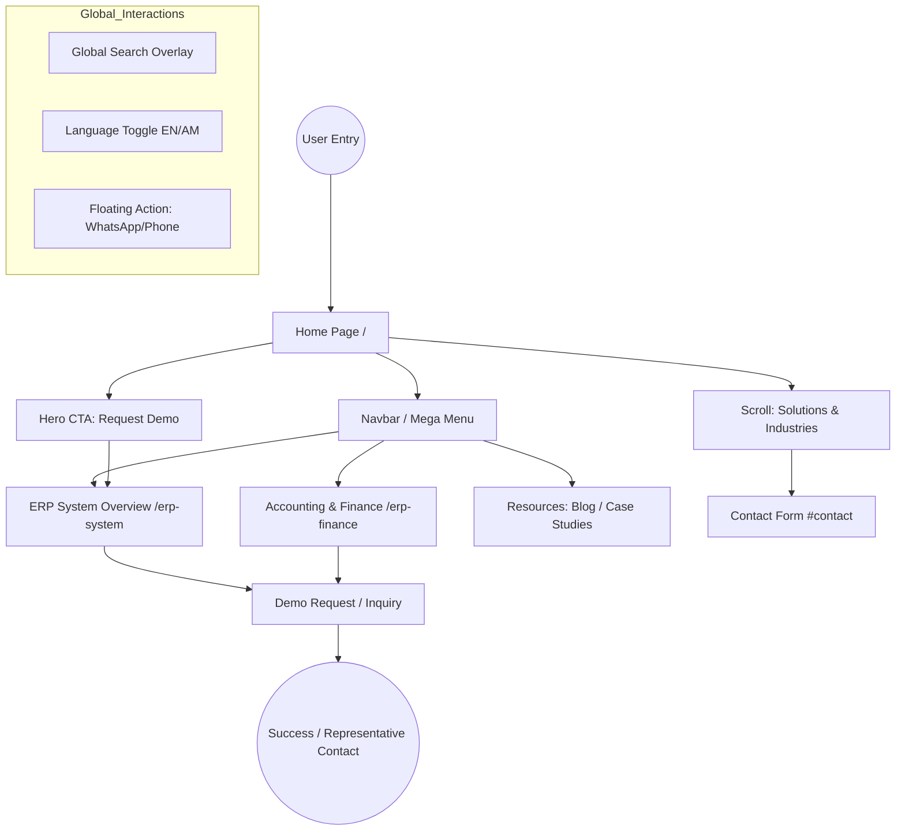

# Project Documentation: Technologies & Sitemap

## 🛠 Technology Stack
The **Y ARC Systems** website is built using a modern, high-performance tech stack:

### Core Languages & Frameworks
- **TypeScript**: Used for all application logic, providing robust type safety and reducing runtime errors.
- **React (v19)**: The foundational frontend library for building the interactive component-based UI.
- **HTML5**: Structured semantic markup used throughout the application.
- **JavaScript (ES6+)**: The underlying runtime language.

### Styling & UI/UX
- **Tailwind CSS (v4)**: A utility-first CSS framework used for rapid UI development and consistent design tokens.
- **Motion (Framer Motion)**: Powering the advanced animations, mega-menus, and smooth transitions.
- **Lucide React**: A library of clean, consistent vector icons.

### Infrastructure & Tools
- **Vite**: The next-generation build tool and development server for lightning-fast performance.
- **React Router (v7)**: Handles client-side routing and navigation between pages.
- **Node.js/npm**: The environment and package manager for dependency handling.

---

## 🔄 Website User Flow
The following diagram and description outline the typical user journey and architectural flow of the **Y ARC Systems** platform.

### 1. User Journey Diagram

### 2. Detailed Journey Breakdown

#### Phase 1: Awareness (Landing)
The user enters via the **Home Page**. They are greeted by a high-impact **Hero Section** that defines Y ARC's engineering value. At this stage, they either:
- **Navigate** via the Mega Menu to explore specific service categories.
- **Scroll** to discover the "Enterprise Solutions" and "Industry Sectors" sections.

#### Phase 2: Exploration (Specific Solutions)
The user moves deeper into the site to evaluate specific software modules:
- **ERP System Overview**: High-level capabilities for enterprise-grade management.
- **Accounting & Finance**: Deep-dive into financial transparency, general ledger, and budgeting modules.

#### Phase 3: Engagement & Discovery
Users utilize global utility features to refine their experience:
- **Search Overlay**: Quickly finding specific industry solutions (e.g., "Healthcare CRM").
- **Language Switcher**: Switching to Amharic for localized understanding.
- **Resources**: Reading Case Studies to validate the firm's expertise.

#### Phase 4: Conversion (The "Lead Hunt")
The ultimate goal of the flow is the **Conversion Point**:
- **Request Demo**: Prominent CTAs lead users to detailed inquiry forms.
- **Contact Form**: Located in the footer, allowing for specific project discussions.
- **Floating Actions**: Providing an immediate "hotline" for urgent business inquiries.

---

---

## 🏗 Component & Page Directory
A detailed breakdown of every component and page structure within the application.

### 1. Pages (`/src/pages`)
These are the top-level route components defined in `App.tsx`.

- **🏠 Home (`Home.tsx`)**: The primary landing page. It acts as an assembly for the core marketing components (Hero, Stats, Expertise, etc.).
- **⚙️ ERP System (`ERPSystem.tsx`)**: A feature-rich deep dive into the Enterprise Resource Planning suite. Includes module breakdowns, business benefits, and tailored CTAs.
- **💰 ERP Finance (`ERPFinance.tsx`)**: A specialized module page for Accounting & Finance. Features interactive tabs for General Ledger, Accounts Payable/Receivable, and Budgeting.

### 2. Core Components (`/src/components`)
Modular elements used across pages to maintain UI consistency and logic.

- **🗺 Navbar (`Navbar.tsx`)**: The most complex component. Contains:
    - **Mega Menus**: Dynamic overlays for Services, Industries, and Resources.
    - **Search Overlay**: A full-screen interactive search interface.
    - **Utility Bar**: Contact info and a multi-flag language switcher (EN/AM).
- **🚀 Hero (`Hero.tsx`)**: The visual entrance. Features a high-contrast design, animated backgrounds, and the primary "Request Demo" CTA.
- **📊 Stats (`Stats.tsx`)**: A high-visibility section showcasing vetting talents, delivered projects, and cost-saving metrics.
- **🛠 Expertise (`Expertise.tsx`)**: A grid-based showcase of core technical capabilities (AI, Cloud, Custom Dev).
- **🏢 EnterpriseSolution (`EnterpriseSolution.tsx`)**: Focuses specifically on the modular nature of Y ARC's ERP offerings.
- **🌍 Industries (`Industries.tsx`)**: Interactive tabs/cards highlighting sector-specific expertise (Healthcare, Real Estate, etc.).
- **✅ Benefits (`Benefits.tsx`)**: Details the "Why Outsource" value proposition, focusing on speed and quality.
- **💡 WhyUs (`WhyUs.tsx`)**: Highlights the unique engineering standards and the "Human-Centered Design" philosophy.
- **✉️ Footer (`Footer.tsx`)**: Dual-purpose component containing the **ContactSection** (Lead Form) and the global footer links.
- **🖱 CursorGlow (`CursorGlow.tsx`)**: A modern UX enhancement that follows the user's cursor with a subtle, themed glow.
- **📱 FloatingActions (`FloatingActions.tsx`)**: Provides immediate access to communication channels (WhatsApp, Call, etc.).
- **🔝 ScrollToTop (`ScrollToTop.tsx`)**: A functional utility ensuring the user starts at the top of the page after navigation.
- **📖 Introduction (`Introduction.tsx`)**: A narrative section bridging the Hero and the technical capabilities.

---

## 🗺 Sitemap Structure
The website is architected with a logical hierarchy to ensure ease of navigation for both users and search engines.

### 1. Primary Pages (Direct Routes)
| Route | Page Name | Description |
|-------|-----------|-------------|
| `/` | **Home** | The landing page featuring hero section, core solutions, and contact. |
| `/erp-system` | **ERP System** | Detailed overview of Enterprise Resource Planning solutions. |
| `/erp-finance` | **Accounting & Finance** | Specialized page for the ERP Financial module. |

### 2. Main Navigation (Mega Menu Hierarchy)

#### A. Services
Focuses on technical capabilities and solution offerings.
- **Enterprise Solutions**: ERP, Finance, HR & Payroll, Asset Management.
- **Custom Software**: Business Automation, Enterprise Apps, Internal Platforms.
- **Web & Digital Solutions**: Corporate Websites, E-Commerce, Web Apps.
- **System Integration**: API Integrations, SMS/Payment Gateways, Biometrics.
- **Digital Marketing**: SEO Solutions, Brand Promotion.
- **Security & Infrastructure**: CCTV, Network Config, Technical Support.
- **Support & Maintenance**: Upgrades, Training, Deployment.

#### B. Industries
Tailored solutions for specific business sectors.
- **Healthcare**: Hospital & Clinic Management, Pharmacy, Labs.
- **Real Estate**: CRM, Property Management, Sales Pipelines.
- **Enterprise & Corporate**: ERP, Accounting, HR & Procurement.
- **Retail & Distribution**: Inventory, POS, Multi-branch Management.
- **Digital Commerce**: Websites, E-Commerce, Engagement.
- **Technology & Software**: Custom Dev, CRM, API Integration.
- **Security & Infrastructure**: CCTV, Biometrics, Business Security.
- **Small & Medium Business**: Digitization, Automation, Scalable ERP.
- **Import & Export**: Logistics, Customs, Supply Chain.

#### C. Resources & Company
Internal content and corporate information.
- **Resources**: Blog, Case Studies.
- **Learn**: Our Clients, Testimonials.
- **Company**: Our Story, Life @Y ARC.

### 3. Functional Sections (Anchor Links)
- **#contact**: The integrated contact and inquiry form.
- **#solutions**: Section highlighting key service offerings on the Home page.
- **#industries**: Section showcasing sector expertise on the Home page.

### 4. Utility & Global Elements
- **Language Switcher**: Support for English (EN) and Amharic (AM).
- **Search System**: Global search for solutions and resources.
- **Request Demo**: Primary Call-to-Action (CTA) leading to ERP solutions.
- **Footer**: Contains quick links, contact info, and legal copyright.
